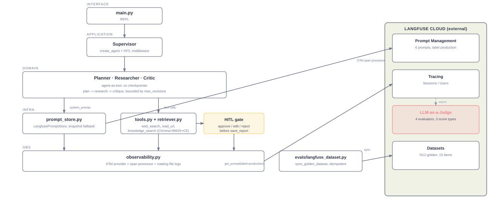
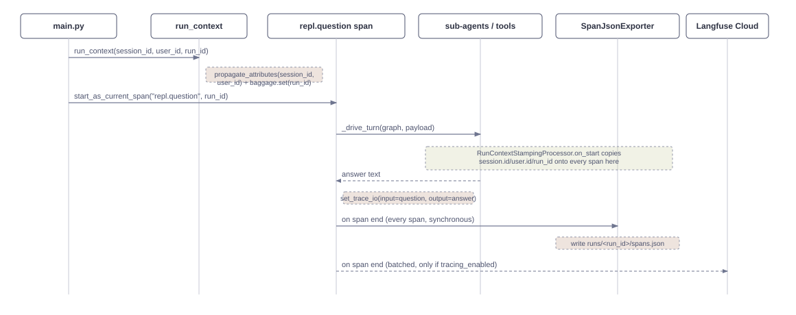

# MA_systems_hl12 — Langfuse observability for a multi-agent research system

A terminal multi-agent research system — Supervisor → Planner → Researcher →
Critic in a Plan → Research → Critique loop — instrumented end to end with
**Langfuse**: tracing, sessions/users, prompt management, and 4 LLM-as-a-Judge
evaluators.

This repository solves homework-lesson-12. The system itself is ported from
[`MA_systems_hl11`](https://github.com/felkost/MA_systems_hl11); the
engineering weight here sits in `prompt_store.py`, `observability.py` and
`evals/`.

## Results

| Requirement | Evidence |
|---|---|
| Tracing | 4 traces, 26-45 spans each, full call tree |
| Session / user | Shared session, user id attached |
| Prompt Management | 6 prompts, zero hardcoded text |
| LLM-as-a-Judge | 4 evaluators, 3 score types |
| Screenshots | 4 / 4, in [`screenshots/`](screenshots/) |

Full write-up, diagram, and screenshots: **[`report/report.html`](report/report.html)**
([`report/report-ua.pdf`](report/report-ua.pdf) for a Ukrainian-language edition).

## Architecture



## Usage scenario, with Langfuse



| Step | What happens |
|---|---|
| 1 | Ask a question in the REPL |
| 2-4 | Plan → Research → Critique (capped revisions) |
| 5 | Approve / edit / reject the report |
| 6 | Trace complete — visible in Langfuse's **Tracing** tab |
| 7 | Evaluators score it, ~1-2 min later — **Scores** tab shows 4 |

## Setup

```bash
python -m venv .venv
.venv/Scripts/python.exe -m pip install -r requirements.txt -r requirements-dev.txt
cp .env.example .env
```

Fill in `.env`: `OPENROUTER_API_KEY`, and `LANGFUSE_PUBLIC_KEY` /
`LANGFUSE_SECRET_KEY` / `LANGFUSE_BASE_URL` for a Langfuse Cloud project
made for this assignment — do not reuse an `MA_systems_hl11` project's keys.

`deepeval` is in `requirements-dev.txt`, not `requirements.txt`: a test
tool, not a runtime dependency.

## Seed the prompts

Six prompts, fetched from Langfuse by name + label `production`, none
hardcoded: `hl12-planner`, `hl12-researcher`, `hl12-critic`,
`hl12-supervisor`, `hl12-composer`, `hl12-critic-verification`.

## Run

```bash
python ingest.py     # build the Chroma index from data/
python main.py       # the REPL
```

Reports land in `output/` only after human approval. Every turn is one
Langfuse trace, grouped by `--session-id` / `--user-id`.

## Tests

```bash
# Offline gate — no network, no cost.
.venv/Scripts/python.exe -m black --check . tests/*.py && \
.venv/Scripts/python.exe -m flake8 . && \
.venv/Scripts/python.exe -m mypy . && \
.venv/Scripts/python.exe -m pytest -q -m "not smoke and not eval"

# Smoke — boots real services. On request.
.venv/Scripts/python.exe -m pytest -q -m smoke

# Evaluation — calls live models, costs money.
deepeval test run tests/
```

## Layout

Flat module layout, layering enforced by `tests/test_layering.py`.
`data/` — source corpus. `output/` — approved reports. `screenshots/` —
the 4 required Langfuse UI screenshots.

## What leaves this machine

Model calls → OpenRouter. Traces, prompts, evaluator calls → Langfuse
Cloud. Nothing else — no self-hosted service, no graph database, no
MCP/A2A network hop.

## License

MIT — see `LICENSE`.
